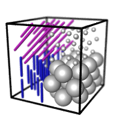

#Models for Multidimensional Diffusion MRI

Multidimensional dMRI is a family of methods using advanced gradient modulation schemes and data processing to simultaneously quantify several microstructural and dynamical parameters by separating their effects on the detected MRI signal in multiple acquisition and analysis dimensions.

Three families of models are currently implemented within the framework:
* Diffusion tensor distributions
* Diffusional exchange
* Diffusion and incoherent flow

The models are described briefly below, in some more detail in two review articles,1,2 and more completely in the original publications cited for each model. The description assumes familiarity with conventional dMRI terminology, such as diffusion tensor, diffusion anisotropy, kurtosis, orientation distributions function, and intravoxel incoherent motion, as well as the commonly used acronyms DTI, FA, DKI.3-6

##Diffusion tensor distributions
The diffusion tensor distribution (DTD) model relies on the assumption that the water molecules within a voxel can be grouped into sub-ensembles exhibiting anisotropic Gaussian diffusion as quantified by a microscopic diffusion tensor **D**, which can be reported as a 3x3 matrix and visualized as an ellipsoid or a superquadric with semi-axis lengths and directions given by the tensor eigenvalues and eigenvectors. Somewhat colloquially, a diffusion tensor is characterized by its size, shape, and orientation, which are properties that are given by the chemical composition and micrometer-scale geometry of the pore space in which the water is located.

The figure above is a schematic illustration of a heterogeneous voxel as a collection of microscopic diffusion tensors, each representing a sub-ensemble of water molecules. While conventional DTI and DKI yield parameters where the information about the sizes, shapes, and orientations of the members of the collections are inextricably entangled, the DTD models are designed to give “clean” size, shape, and orientation measures that are intuitively related to conclusions that can be drawn by simply looking at a picture with a schematic ensembles. For the voxel above, we see four types of microscopic tensors: two spherical ones having different sizes and two nearly linear ones with identical size and shape, but different orientations.

and the composition of a voxel is reported with a probability distribution _P_(**D**).

###size-shape-orientation 
* dtd_6d_full, integral transform, lsqnonneg shotgun
* dtd_4d_full, integral transform, lsqnonneg shotgun
* dtd_qti, 2-term cumulant <**D**> **C**, \
* dtd_dti, 1-term cumulant <**D**>, \

###size-shape
* dtd_pa_full, integral transform, lsqnonneg shotgun
* dtd_pa_cum2, 2-term cumulant <_D_iso>, V(_D_iso), lsqcurvefit
* dtd_pa_gamma, gamma, lsqcurvefit
* dtd_pa_codivide, constrained 3 comp, lsqcurvefit
* dtd_pa_ndi, constrained 2 comp, lsqcurvefit
* dtd_pa_pake, 1 comp, lsqcurvefit

###size
* dtd_iso_full, integral transform, lsqnonneg shotgun
* dtd_iso_gamma, gamma, lsqcurvefit
* dtd_iso_exp, exp, lsqcurvefit

##Diffusional exchange
fexi11

##Diffusion and incoherent flow
vasco16

#References
1. D. Topgaard. NMR methods for studying microscopic diffusion anisotropy. In: R. Valiullin (Ed.) Diffusion NMR in confined systems: Fluid transport in porous solids and heterogeneous materials, New Developments in NMR 9, Royal Society of Chemistry, Cambridge, UK (2017).
2. D. Topgaard. Multidimensional diffusion MRI. J. Magn. Reson.,  (2017).
3. D. Le Bihan, E. Breton, D. Lallemand, P. Grenier, E. Cabanis, M. Laval-Jeantet. MR imaging of intravoxel incoherent motions - application to diffusion and perfusion in neurological disorders. Radiology 161, 401-407 (1986).
4. P.J. Basser, J. Mattiello, D. Le Bihan. Estimation of the effective self-diffusion tensor from the NMR spin echo. J. Magn. Reson. B 193, 247-254 (1994).
5. P.J. Basser, C. Pierpaoli. Microstructural and physiological features of tissues elucidated by quantitative-diffusion-tensor MRI. J. Magn. Reson. B 111, 209-219 (1996).
6. J.H. Jensen, J.A. Helpern, A. Ramani, H. Lu, K. Kaczynski. Diffusional kurtosis imaging: The quantification of non-Gaussian water diffusion by means of magnetic resonance imaging. Magn. Reson. Med. 53, 1432-1440 (2005).

